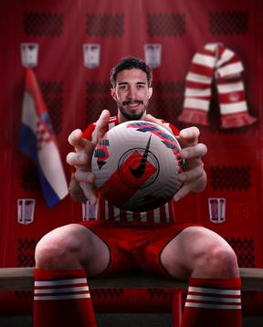

# About Me

Hi, my name is Nick. I'm a Greek 19 year old amateur graphic designer that makes designs and edits using Adobe Photoshop CC 2022.
I have been using Photoshop for around 4 years. I started my journey as logo, banner and thumbnail designer for youtube channels. After a while, I started having an interest in making sport designs which so far worked pretty well. I have a decent follower count which follows me and have some bigger pages asking me for work. My dream is to work for a big company as a graphic designer like [433](https://www.instagram.com/433) or for a sport team.

# My Work

Here are some examples of my work:

More of my work can be found on my [Instagram](https://www.instagram.com/ntdesignart) page.

# Contact
+ Email: ntdesignart.gr@gmail.com
+ Instagram: [ntdesignart](https://www.instagram.com/ntdesignart)

